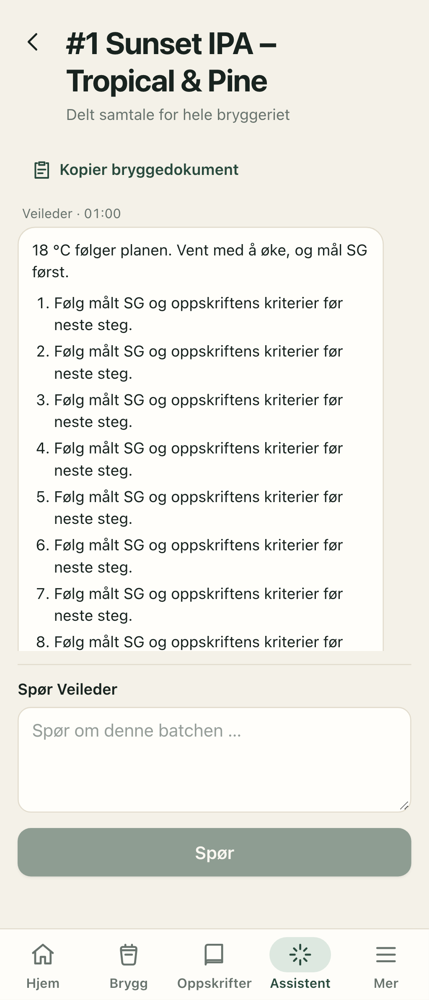

# Sonnet medium eller high — 2026-10-05

**Behold Sonnet 5.5 med medium effort.** Denne prøven viste ingen tydelig samlet kvalitetsgevinst ved high. De største
forbedringene kom fra verktøy-/svarhåndtering og korrekt kontekst. Haiku er utelatt etter Brages valg (B19).

## Hva som er fullført

- 21 syntetiske norske situasjoner: sammensatte spørsmål, planer, hypotetiske spørsmål, eksisterende målinger,
  delte kar, avklaring i neste melding, avviste forslag, korrigering og historiske tidspunkt, pH, SG og kaldkrasj.
- Samme kontekst og skriptede samtalehistorikk for begge profiler, to repetisjoner og maksimalt to samtidige spørsmål.
- En full sammenligning med 84 svar, deretter 32 sluttkontroller av åtte berørte situasjoner etter siste rettelser.
- Delt estimert stoppbudsjett, atomiske delresultater og gjenopptakelse som ikke betaler for ferdige svar på nytt.
  Gjenopptakelse krever identiske hasher for fixture, prompt og verktøy, og identiske profiler/repetisjoner.
- Ingen produksjonsdata, databaseendringer eller nettsøk. Vanlige tester bruker fake-klienter og aldri API-nøkkelen.

## Feil prøven fant, og hvordan de ble rettet

**Råd forsvant eller ble aldri gitt.** Den gamle løperen brukte bare sluttmeldingens tekst. En modell kunne gi tekst før
et verktøykall, og den kunne også slutte med bare «målingen er klar». `propose_actions` krever nå et komplett `answer` sammen
med minst én handling. Appen viser dette svaret før kortene og utelater en redundant sluttkvittering. Uten forslag brukes
fullstendig slutttekst; tidligere tekst er reserve hvis sluttteksten mangler. Avvisningsforklaringer beholdes. En tom
handlingsliste avvises: et vanlig spørsmål trenger ingen ekstra verktøyrunde bare for å levere svartekst.

**Navnet på et kar var ikke nok.** Maskinbriefet hadde navnene, men manglet id-ene. Modellen kunne skrive «Tropical» i
merkelappen og likevel foreslå en måling på hele batchen. Briefet har nå id/navn/kar, og gjæringsmålinger må ha en gyldig
variant-id når batchen er delt. Id-ene vises ikke i det menneskelige bryggedokumentet.

**Korrigering og historiske målinger ble nye oppføringer.** Prompt og verktøybeskrivelse forklarer nå at disse skal gå
gjennom den eksisterende loggflyten. Et forslag kan ikke sette tidspunkt, og skal derfor ikke føre gårsdagens måling som nå.

**Evaldata måtte også rettes.** Et `stageStartedAt` fire dager tidligere ga ikke alene gjæringsdag 4; domenet henter
pitch-/startdato fra loggen. De berørte fixturene har nå en konsistent `fermentation_started`-hendelse. En streng tidlig
sjekk ga dessuten falsk feil for en ny smakskommentar i kaldkrasjtilfellet: SG var allerede logget, men «ingen smørsmak» var
en ny opplysning. Den valgfrie kommentaren tillates nå; ny duplikat-SG gjør det ikke.

## Visning på mobil

Et nytt assistentsvar åpnes ved starten av teksten, slik at rådet kommer før loggkortet. Ved sending følges spørsmålet og
ventestatusen. Også en full 100-meldingers historikk oppdaterer visningen når siste meldings-id endrer seg. Automatisk
rulling bruker ingen animasjon. En mobiltest viser at første rådslinje er i skjermen når svaret er lengre enn samtalefeltet,
og at ingen måling blir opprettet av å vise kortet. API-svaret i denne UI-testen er simulert.



## Resultat

Hovedprøven hadde 42 svar per profil. Medium bestod 42/42 automatiske kontraktsjekker. High hadde 40/42, der begge flaggene
var den valgfrie smakskommentaren ovenfor. Råresultatene er beholdt; dette er ikke to påviste modellfeil.

Etter siste rettelser ble åtte berørte situasjoner kjørt to ganger per profil:

| Sluttkontroll | Sonnet medium | Sonnet high |
|---|---:|---:|
| Fullførte svar / riktige handlingskontrakter | 16 / 16 | 16 / 16 |
| Gjennomsnittlig svartid | 9,15 s | 10,90 s |
| Median svartid | 8,91 s | 11,09 s |
| Gjennomsnittlig ordantall i vist svar | 161 | 181 |
| Svar over 160 ord | 9 | 12 |
| Estimert samlet pris for de 16 svarene | 0,327 USD | 0,371 USD |

Dette er et lite kontrollsett med to repetisjoner, samtidige kall og cacheeffekter. Det måler løperen fra denne maskinen,
ikke faktisk ventetid på en telefon gjennom produksjons-Workeren. Profilrekkefølgen vekslet, men prøven er ikke et blindt
eller statistisk robust benchmark. Hovedprøven og sluttkontrollen har ulike kontekst-/prompt-/verktøyhasher og skal ikke
slås sammen til én kvalitetsscore.

De komplette svarene fra hovedprøvens første repetisjon og begge repetisjonene i sluttkontrollen er lest mot kriteriene
for relevans, grunnlag, fullstendighet og praktisk neste steg. Det er Codex' kvalitative vurdering, ikke en uavhengig fasit.
Automatisk gyldig handling betyr ikke automatisk godt råd.

## Gjenværende kvalitetsfunn

- Begge profiler svarer nå på temperatur og neste handling sammen med det korrekte loggkortet. Ukjent kar blir avklart,
  og en tidligere oppgitt verdi kan knyttes til riktig kar i oppfølgingsmeldingen.
- Noen svar er fortsatt for lange. High ga ingen tydelig gevinst i korthet eller presisjon i dette utvalget.
- Enkelte temperaturdifferanser og dato-/varighetsresonnementer blir skrevet uten beregningsverktøy. Dette bryter ønsket
  regneregel selv om tallene kan se plausible ut. Det er et eget oppfølgingspunkt; ikke en grunn til automatisk høyere effort.
- Noen formuleringer er for sikre: antatt gjæringsfremdrift uten SG, manglende tilsetningslogg behandlet som at tiden ikke
  har begynt å løpe, eller en nylig oppgitt måling beskrevet som allerede loggført. En medium-formulering om korrigert
  temperatur var selvmotsigende. En high-formulering foreslo unødvendig finjustering av en temperatur innenfor planen.
- Planlagt FG brukes ikke som faktisk måling i kontrollsettet. Ferdig gjæring bygger på stabil målt SG og oppskriftens
  kriterier. Syredose ble ikke anslått. Rådene er likevel ikke validert på et faktisk brygg.

Neste forbedring bør derfor være kortere og mer presis svartekst, tydeligere skille mellom «oppgitt nå» og «lagret», og
en gjennomgang av de numeriske utsagnene som mangler beregningsverktøy. Vi innfører ingen Jev- eller Haiku-ruting nå.

## Kostnad og etterprøvbarhet

Registrert estimert API-forbruk for denne oppfølgingen er omtrent **3,86 USD**, inkludert to avbrutte utforskingsprøver.
Eventuelle svar som var underveis da en prøve ble avbrutt, kan være fakturert uten å være med i delrapporten. Den annonserte
estimerte totalrammen ble økt fra 3 til 4 USD før de manglende sammenligningssvarene ble fullført. Fakturaen er fasit.

Hele spørsmål, forventninger, svar, handlinger, rundetekst, token-/cachebruk, hashes, tallgrunnlag og vurderingsnotater:
[assistant-effort-2026-10-05.json](reviews/assistant-effort-2026-10-05.json).

```bash
# Ingen API-kall eller nøkkellesing
npm run eval:assistant -- --compare --repeats 2

# Ny betalt prøve; budsjettet gjelder hele prøven, ikke hvert spørsmål
npm run eval:assistant -- --live --compare --repeats 2 --concurrency 2 --budget-usd 2

# Fullfør bare oppgaver som ble hoppet over på grunn av budsjettet
npm run eval:assistant -- --live --compare --repeats 2 --concurrency 2 --budget-usd 3 --resume eval-results/<rapport>.json
```

`--case` tar ett eller flere kommaseparerte id-er og avviser ukjente/dupliserte id-er før noe betalt kall. Samme syntetiske
input må brukes ved gjenopptakelse. Et endret testsett eller verktøy krever en ny prøve, og tidligere forbruk bevares i budsjettet.

Kodeverifikasjon: typecheck, 493 enhets-/integrasjonstester + 1 KV-test, build, 24 mobiltester og `git diff --check`. Modellprøvene er
separate fra CI. Ingen migrasjon eller endring av produksjonens modell-/effort-innstilling er nødvendig for denne oppfølgingen.
