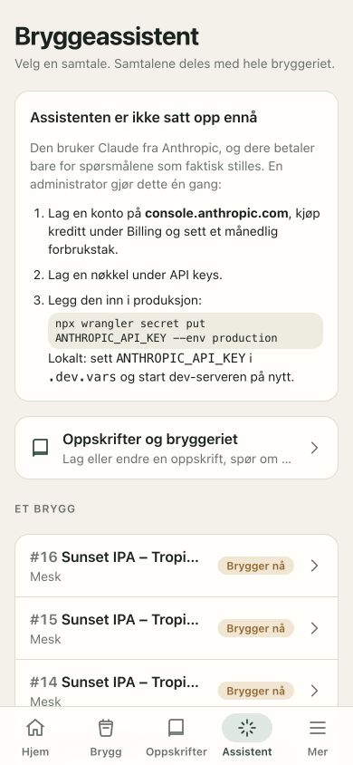
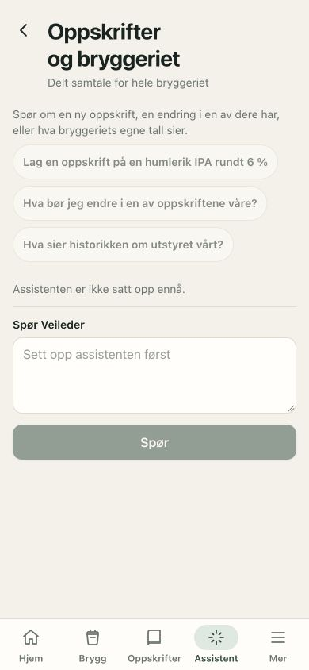
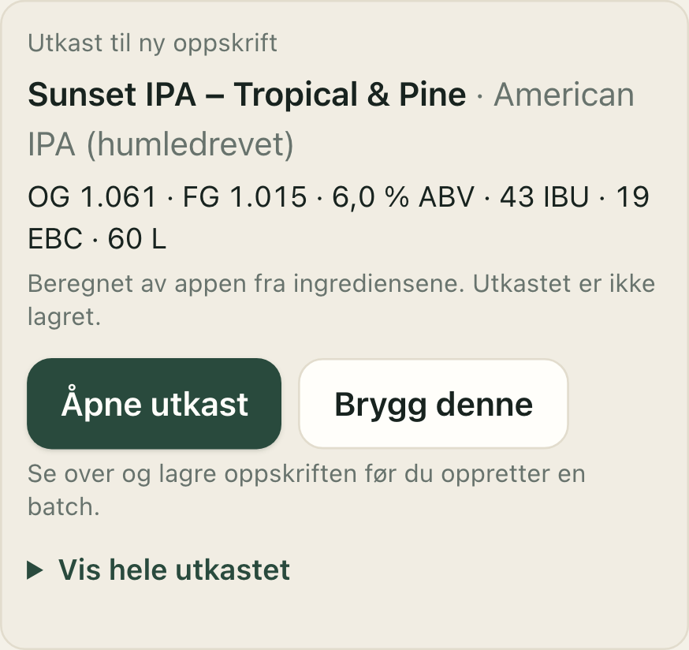

# App, assistent og skills — gjennomgang 2026-10-05

## Konklusjon og levert arbeid

Behold Claude Sonnet 5.5 som standard. Den konkrete loggføringsfeilen skyldes blant annet instruksen som ba modellen
foreslå logging så snart en måling ble nevnt. Instruksen krevde ikke først svar på resten av spørsmålet. Den er nå endret:
besvar alle delspørsmål, hent relevant plan og gi råd før et valgfritt kort for en tydelig ny faktisk observasjon.

Arbeidet fortsetter den påbegynte leveransen 14c og fullfører 14d i implementeringsplanen. De eksisterende lokale
endringene i bryggeritråd, oppskriftsverktøy, beregninger og migrasjon 0013 er beholdt. Nye endringer kobler utkastet til
redigereren, bevarer forespørselen som kilde, fryser grunnversjonen og hindrer gamle utkast fra å erstatte nyere arbeid.
«Brygg denne» krever gjennomgang og lagring av oppskriften før den åpner eksisterende batchveiviser.

I tillegg er modellkompatibilitet, caching og prisanslag justert. Haiku/4.5 får ikke adaptive thinking; de bruker grunnversjonen
av nettsøk. Søket er direkte, med samme kildeavgrensning og to-søksgrense. Stabil systeminstruks har eget cachepunkt, og
Opus 5.5 bruker riktig cachepris. En tom sluttmelding etter et verktøy gir ett nytt svarforsøk innen den eksisterende
rundegrensen. Forslag lagres fortsatt bare som forslag; modellen kan ikke skrive til oppskrifter, batcher eller bryggelogg.

## Appgjennomgang: fem steg

Omfang: assistentinngangen og oppskrift → batch-flyten, i mobilbredde. Skjermbilder fra denne gjennomgangen finnes under
`reviews/assets/`. Inngang og tomtilstand er kontrollert i Codex-nettleseren; utkast, redigering og veiviser er kontrollert med
Playwright mot den isolerte testdatabasen. Oppskriftskortet er et simulert assistentsvar; lagring og navigasjon bruker ekte
lokale API-endepunkter. De 23 mobiltestene dekker også bryggedag, timere, vann og pH. Dette er ikke en full audit av alle
produksjonsskjermer eller en bekreftelse på WCAG-samsvar.

| Steg | Vurdering | Funn og oppfølging |
|---|---|---|
| 1. Assistentinngang | Fungerer, bør forenkles | Valget mellom bryggeritråd og batcher er klart. Oppsettsinstruksen med terminalkommandoer tar nesten hele første mobilskjerm når nøkkelen mangler; legg detaljene bak «Oppsett for administrator». Dette er en senere UI-oppgave. |
| 2. Bryggeritrådens tomtilstand | Fungerer | Tre startspørsmål, tydelig forklaring og deaktivert felt når API-et mangler. Feltet har etikett. Lange startspørsmål trenger fortsatt plass på liten skjerm. |
| 3. Oppskriftsutkast | Fullført | Appberegnede tall, synlig «ikke lagret», «Åpne utkast» og «Brygg denne». Ingen skriving ved åpning. Detaljer kan åpnes; lang oppskrift i samtalens eget rulleområde bør vurderes i neste UX-runde. |
| 4. Gjennomgang og lagring | Fullført | Vanlig redigerer, endringsmulighet og eksplisitt lagring. Kilde bevares. Versjonsutkast blokkeres hvis oppskriften har endret seg. Det lange redigeringsskjemaet trenger en egen vurdering før det utvides mer. |
| 5. Batchveiviser | Fungerer | Lagret oppskrift er valgt, størrelse/utstyr/oppsummering gjenbrukes. «Brygg denne» oppretter ingen batch i bakgrunnen. |

[Hele utkastvisningen](reviews/assets/03-assistant-draft.png),
[4. Forhåndsutfylt redigerer](reviews/assets/04-assistant-editor.png) og
[5. Batchveiviser etter lagring](reviews/assets/05-assistant-brew-wizard.png).

Mobiltestene kontrollerer at flyten ikke gir horisontal rulling. Handlingslenkene bruker designsystemets minst 44 px høye
flater. Tastatur, skjermleser og kontrast er ikke fullstendig testet i denne gjennomgangen.

## API-tilgang og oppsett

| Kontroll | Resultat | Begrensning |
|---|---|---|
| Lokal Anthropic-nøkkel | Finnes; autentisert modelliste svarte, og Sonnet 5.5 er tilgjengelig | Verdien er ikke skrevet til logger eller dokumenter. Tilgjengelig modell er ikke en bekreftelse på fremtidig kredittramme. |
| Produksjonssecrets | Cloudflare lister `ANTHROPIC_API_KEY`, `BETTER_AUTH_SECRET`, `BREWERY_ACCESS_CODE` | Listen viser bare navn. Produksjonsnøkkelens verdi og kredittramme er ikke lest eller testet med et produksjonsspørsmål. |
| Modell | Sonnet 5.5 lokalt/produksjon/serverstandard, medium effort og adaptive thinking | Ingen grunn til å bytte leverandør uten sammenlignbare evaler. [Anthropic anbefaler medium som utgangspunkt for chat med lav ventetid](https://platform.claude.com/docs/en/build-with-claude/effort). |
| Secrets og datatilgang | API-nøkkel brukes bare i Worker; bryggeriets medlemskontroll og scoped data-loader beholdes | Jev ville være en separat leverandør med eget secret, ikke utvidet tilgang til databasen. |
| Grenser | 40 spørsmål per bryggeri per UTC-døgn, 10/min, 6/8 verktøyrunder og to nettsøk per spørsmål | Dagsgrensen er antall spørsmål, ikke et hardt dollarbudsjett. Faktisk månedlig tak/kreditt må kontrolleres i Anthropic Console. |
| TypeSafe | Ingen `TYPESAFE_API_KEY` i lokal `.dev.vars`; ingen integrasjon eller nytt abonnement opprettet | Konto- og nøkkeltilgang er ikke bekreftet. |

Modellvalgene har fått kompatible thinking-parametere. [Anthropics thinking-dokumentasjon](https://platform.claude.com/docs/en/build-with-claude/extended-thinking)
forklarer at adaptive thinking ikke støttes av blant annet Haiku 4.5. [Nettsøkdokumentasjonen](https://platform.claude.com/docs/en/agents-and-tools/tool-use/web-search-tool)
skiller grunnversjonen fra dynamisk filtrering og beskriver direkte kall.

Et eget cachepunkt for den stabile instruksen gir mulighet for gjenbruk når briefet endrer seg. Det er ingen garanti for
cachetreff: hele prefikset må være likt, og endringer i verktøy/oppsett kan bryte det. [Prompt caching](https://platform.claude.com/docs/en/build-with-claude/prompt-caching)
beskriver både prefiksreglene og de modellspesifikke prisene. Appens anslag er fortsatt ikke en faktura.

Zod-skjema og scoped verktøy er allerede i bruk. Native strict tool use kan redusere feil JSON, men løser ikke at modellen
misforstår hva brukeren vil. Ikke slå på strict for hele katalogen ukritisk: [structured outputs](https://platform.claude.com/docs/en/build-with-claude/structured-outputs)
har grenser for valgfrie felt/unions, og JSON-format på sluttmeldingen kan kollidere med citations. Vurder det for en liten
kritisk del av verktøyene med egne API-prøver først.

## Ekte prøver av Sonnet og Haiku

Åtte syntetiske norske meldinger dekker ny måling + råd, planlagt temperatur, hypotese, «ikke logg», allerede logget verdi,
forrige batch, sitat og ren loggbestilling. Ingen produksjonsdata ble lest eller sendt, ingen database ble skrevet,
og nettsøk var av for å isolere forståelse og bruk av appkontekst.

| Modell | Handlingssjekker | Estimert kostnad for åtte | Gjennomsnittlig svarventetid |
|---|---|---|---|
| Sonnet 5.5, medium | 8/8 | 0,126 USD | 6,93 s |
| Haiku 4.5, API-standard | 8/8 | 0,045 USD | 5,43 s |

Dette er **én prøve per modell**, med cacheeffekter og uten blind vurdering. Det er ikke et ytelsesbenchmark og sier ikke
hva gjennomsnittskostnaden blir i produksjon. Handlingssjekkene alene skjuler viktige feil:

- Sonnet besvarte delspørsmålene og hentet relevant plan. Flere svar var for lange. Et hypotetisk svar slo for sikkert fast
  at temperaturen ikke kunne være problemet. Disse funnene står fortsatt på kvalitetslisten.
- Den gamle løperen viste i ett Haiku-tilfelle ingen svartekst etter loggforslaget. Senere fant vi at løperen kastet bort tekst
  fra verktøyrundene, så dette kan ikke tilskrives modellen alene. Andre svar hadde dårligere forankring i planen, feil retning
  på SG ved hop creep og språkfeil. Derfor anbefales ikke automatisk overgang til Haiku som bryggrådgiver.
- Etter denne sammenligningen er ett begrenset nytt forsøk ved tomt svar implementert og dekket med fake-klient-tester.
  Evalskriptet markerer nå fallback uten substansielt svar som feil. Det gjør ikke andre Haiku-svar bedre.

Fullt spørsmål, svar, verktøykall, usage og manuelle vurderingsnotater:
[assistant-eval-2026-10-05.json](reviews/assistant-eval-2026-10-05.json).

## TypeSafe Jev: mulig supplement

Jev tar tilstand og typede spørsmål og returnerer strukturerte vurderinger. Det er relevant for å vurdere brukerintensjon,
men ikke en erstatning for en samtalemodell som forklarer brygging eller utformer oppskrifter.
[TypeSafe Introduction](https://docs.typesafe.ai/introduction).

En eventuell prøve skal gi **separate signaler**, slik at «måling» ikke utelukker «vil ha råd»:

1. Er dette en ny faktisk observasjon i denne batchen?
2. Ber brukeren også om forklaring, sammenligning eller feilsøking?
3. Ber brukeren uttrykkelig om at ingenting logges?
4. Trengs oppskriftsplan eller historikk for å svare?

Bruk et lite syntetisk testsett i skygge: Jev vurderer, men endrer ikke hvilke kort eller svar brukeren får. Claude gir
fortsatt forklaringen; appen regner tall og validerer handlinger. Skjema/kode må ikke behandle modellens confidence som
tillatelse til å skrive eller som garanti for riktig forståelse. [TypeSafe Confidence](https://docs.typesafe.ai/confidence)
forklarer sammenhengen mellom confidence og sannsynlighetsfordelingen.

**Beslutningskriterium for en eventuell senere Jev-prøve:** minst 20 norske tilfeller og tre kjøringer, inkludert flere kar, gamle målinger,
korrigeringer og oppfølgingsspørsmål. Jev må gi færre uriktige måleforslag og bevare alle rådsspørsmål, uten alvorlige feil i
«ikke logg»/hypoteser, og total ventetid/kostnad må være akseptabel. En måling+råd-melding skal aldri rutes til bare logging.
Ved feil, lav sikkerhet eller timeout skal Claude beholde mulighet til å svare; ingen handling skal utføres automatisk.

Tilgang krever eget TypeSafe-oppsett. [Den offisielle quickstarten](https://docs.typesafe.ai/introduction/quickstart)
beskriver nøkkel, API og skill. Ingen Jev-kall er gjort her, og leverandørens generelle hastighets-/kvalitetspåstander er ikke
verifisert på Slumps data.

## Plan for skills

Skills hjelper utviklingsagenten å jobbe konsekvent. En installert Codex-skill endrer ikke automatisk assistenten inne i
Slump: den kjører en eksplisitt systemprompt og verktøykatalog. Produktoppførselen må derfor endres og testes i repoet.

| Prioritet | Skill | Status og konkret bruk |
|---|---|---|
| 1 | Offisiell `claude-api` fra Anthropic | Ikke i denne Codex-skilllisten. Anbefalt installasjon ved videre API-arbeid; dekker TypeScript, caching, verktøy og modellbytter. Allerede bundlet i Claude Code ifølge [offisiell dokumentasjon](https://platform.claude.com/docs/en/agents-and-tools/agent-skills/claude-api-skill). Unngå dobbeltinstallasjon der. |
| 2 | Egen `slump-assistant-quality` | Planlagt, ikke opprettet. Pek til produktregler, evalsettet, håndtering av komplette spørsmål, datakilder og kriterier for modellbytte. Skal kreve vurdering av svartekst i tillegg til JSON/handlinger. |
| 3 | Offisiell `typesafe-ai` | Installer bare hvis Jev-prøven skal gjennomføres. Kilde: [typesafe-ai/skills](https://github.com/typesafe-ai/skills/blob/main/skills/typesafe-ai/SKILL.md). Bruk til å utforme separate spørsmål og kontrollere resultatene, ikke til bryggematematikk. |
| Behold | `playwright`, `cloudflare-deploy`, `gh-address-comments`, `gh-fix-ci`, UX/UI-skills | Allerede tilgjengelige. Bruk dem til mobilflyt, release og relevant review; det trengs ikke nye kopier. |
| Senere | Egen `slump-release-qa` | Kun hvis releasekontroll gjentas manuelt: samle krav fra AGENTS, migrasjoner, autorisasjon, tester og PR/CI. Ikke bruk BS Climbing-skillene til Slump. |

Før installasjon: les den eksakte offisielle `SKILL.md`, velg bare den aktuelle skillen og installer gjennom skill-installer.
Ingen nye skills eller plugins er installert i denne leveransen. Jev-skill og API-konto er to separate ting.

## Neste leveranser i prioritert rekkefølge

1. Merge denne PR-en først etter grønn CI. Den omfatter 14c/14d, loggføringsforståelse og dokumenterte oppfølgingspunkter.
2. Utvid evalsettet og vurder hele svarteksten. Sammenlign medium/high på Sonnet med samme tilfeller, flere repetisjoner og
   målt pris/ventetid; behold medium til en tydelig kvalitetsgevinst er vist.
3. Forenkle assistentinngangen ved manglende nøkkel, og vurder lange oppskriftsutkast og redigeringsskjema på mobil.
4. Installer `claude-api` i Codex; lag den lille Slump-kvalitetsskillen hvis dette blir et fast arbeidsmønster.
5. Gjennomfør Jev-skyggetesten bare hvis den fortsatt løser et dokumentert problem etter steg 2. Vurder strict tool use
   separat; det handler om format/validering, ikke intensjon.

Lokal verifikasjon: `npm run typecheck`, `npm test` (465 + 1 KV = 466 tester), `npm run build`, `npm run e2e` (23 mobiltester)
og `git diff --check`. Live-eval er separat fra CI; normale tester bruker aldri den virkelige Anthropic-nøkkelen.

## Oppfølging: større evalsett og Sonnet alene

Brage valgte 2026-10-05 å droppe Haiku. Videre arbeid sammenligner bare Sonnet medium/high, uten et ekstra AI-kall som
ruter enkle spørsmål til en annen modell. De historiske tallene ovenfor er beholdt som prøvehistorikk, ikke som et forslag
om Haiku i produksjon.

Oppfølgingsarbeidet har 21 norske situasjoner, samtaleforløp, delte kar og korrigeringer. Det fant to kodefeil: tekst fra
verktøyrunder kunne forsvinne fra brukerens svar, og variant-id-ene manglet i maskinbriefet. Begge er rettet. Loggforslag
krever nå også en svartekst som appen viser før kortene. Modellen får ikke lage en ny «nå»-oppføring for en korreksjon eller
historisk måling; dette håndteres i den eksisterende loggflyten med riktig tidspunkt. Fullt sammenligningsresultat og vurdering
følger i [assistant-evaluation.md](assistant-evaluation.md).
